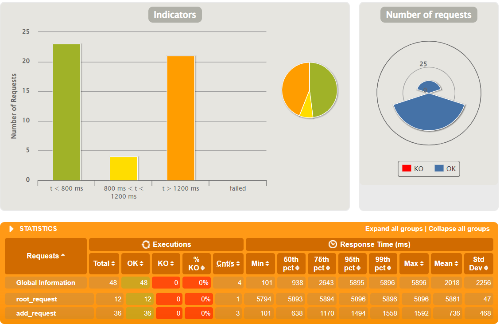
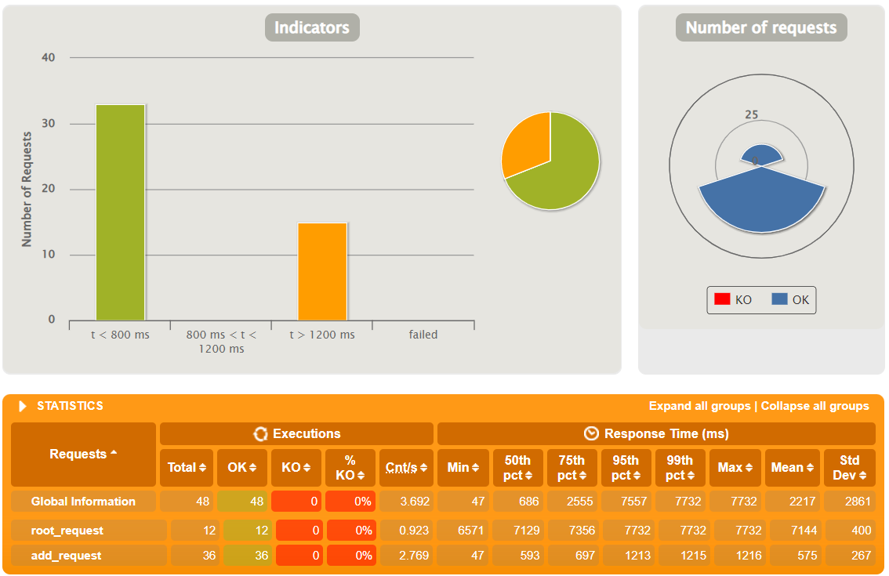
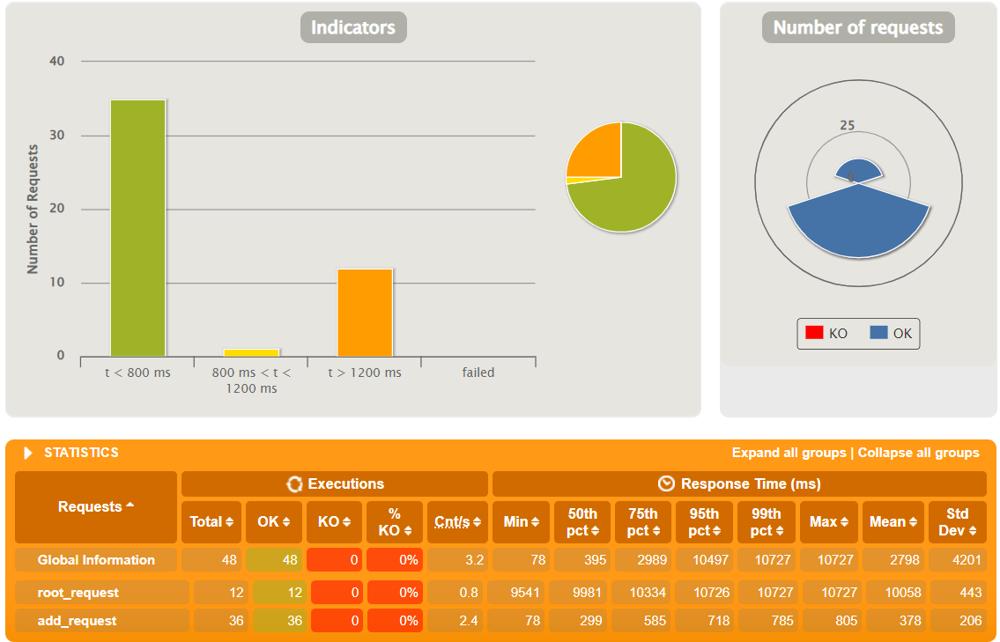
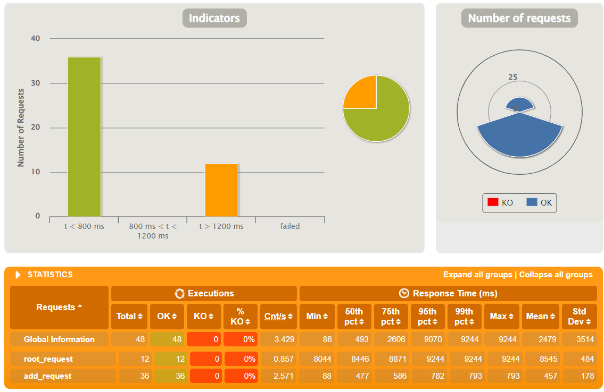
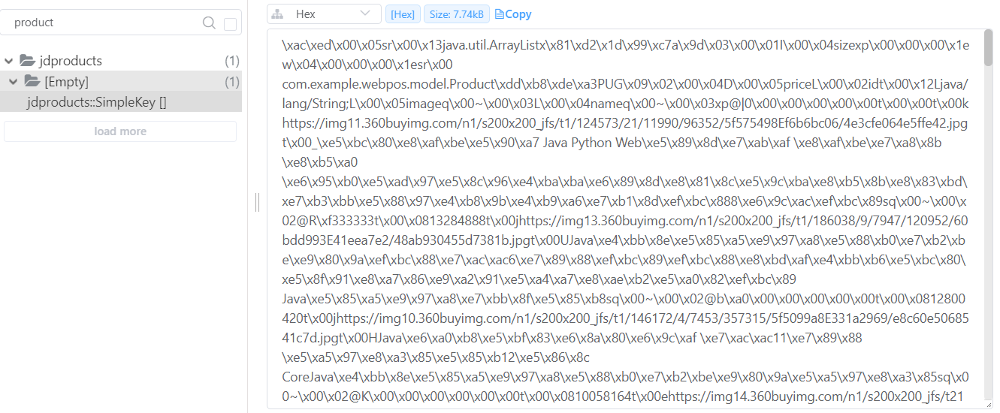
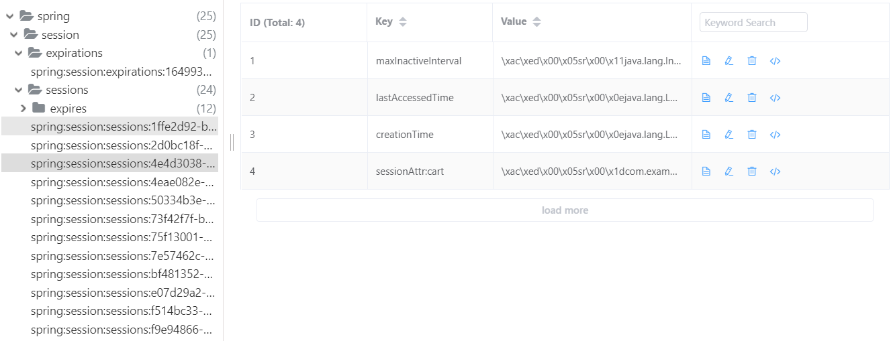

# WebPOS

## Results

使用 HAProxy 进行负载均衡，使用 Redis 作为缓存和会话数据库。使用 Gatling 进行压测，四次实验汇总如下：

| 方法                       | t < 800ms | 800ms < t < 1200ms | t > 1200ms |
| -------------------------- | --------- | ------------------ | ---------- |
| 单实例                     | 23        | 4                  | 21         |
| 4实例负载均衡              | 33        | 0                  | 15         |
| 4实例负载均衡+共享缓存     | 35        | 1                  | 12         |
| 4实例负载均衡+共享缓存会话 | 36        | 0                  | 12         |

具体数据如下。

### 单实例



### 4实例负载均衡



### 4实例负载均衡+共享缓存



### 4实例负载均衡+共享缓存会话



缓存数据：



会话数据：



## Description

The demo shows a web POS system , which replaces the in-memory product db in aw03 with a one backed by 京东.


To run

```shell
mvn clean spring-boot:run
```

Currently, it creates a new session for each user and the session data is stored in an in-memory h2 db. 
And it also fetches a product list from jd.com every time a session begins.

1. Build a docker image for this application and performance a load testing against it.
2. Make this system horizontally scalable by using haproxy and performance a load testing against it.
3. Take care of the **cache missing** problem (you may cache the products from jd.com) and **session sharing** problem (you may use a standalone mysql db or a redis cluster). Performance load testings.

Please **write a report** on the performance differences you notices among the above tasks.

